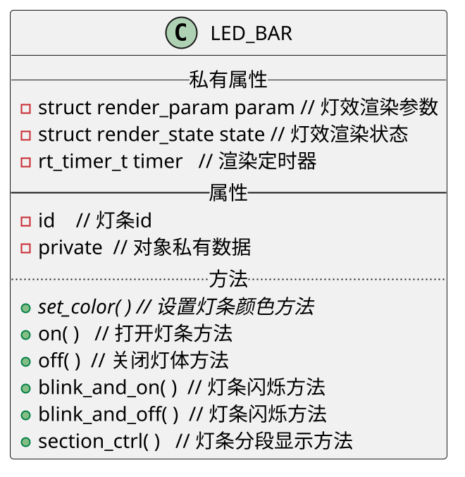
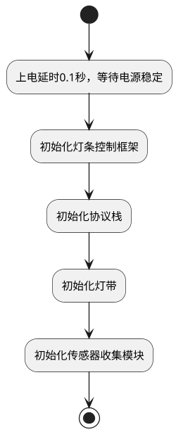

**目录**

<!-- TOC -->

- [1. 引言](#1-引言)
  - [1.1. 编写目的](#11-编写目的)
  - [1.2. 背景](#12-背景)
  - [1.3. 特殊名词定义](#13-特殊名词定义)
  - [1.4. 参考](#14-参考)
- [2. 总体设计](#2-总体设计)
  - [2.1. 概述](#21-概述)
  - [2.2. 功能需求](#22-功能需求)
  - [2.3. 硬件原理图](#23-硬件原理图)
  - [2.4. 系统环境](#24-系统环境)
    - [2.4.1. 开发环境](#241-开发环境)
    - [2.4.2. 固件运行环境](#242-固件运行环境)
- [3. CAN通信协议设计](#3-can通信协议设计)
  - [3.1. 灯条控制](#31-灯条控制)
    - [3.1.1. 灯条编号](#311-灯条编号)
    - [3.1.2. 控制方式一](#312-控制方式一)
      - [3.1.2.1. 灯条颜色编号](#3121-灯条颜色编号)
      - [3.1.2.2. 灯条控制模式](#3122-灯条控制模式)
      - [3.1.2.3. 灯条控制参数](#3123-灯条控制参数)
    - [3.1.3. 方式二](#313-方式二)
  - [3.2. 托盘状态](#32-托盘状态)
    - [3.2.1. 反馈托盘状态](#321-反馈托盘状态)
    - [3.2.2. 托盘检测功能开关](#322-托盘检测功能开关)
  - [3.3. 触摸反馈](#33-触摸反馈)
- [4. 模块设计](#4-模块设计)
  - [4.1 驱动](#41-驱动)
    - [4.1.1 VL53L0x tof测距传感器驱动](#411-vl53l0x-tof测距传感器驱动)
    - [4.1.2 PCF8574驱动](#412-pcf8574驱动)
    - [4.1.3 WS2812灯珠驱动](#413-ws2812灯珠驱动)
  - [4.2 LED灯条控制框架](#42-led灯条控制框架)
    - [4.2.1 灯条对象](#421-灯条对象)
    - [4.2.2 LED_BAR对象方法](#422-led_bar对象方法)
- [5 启动时序](#5-启动时序)
- [6 模块维护及构建要求](#6-模块维护及构建要求)

<!-- /TOC -->

# 1. 引言

## 1.1. 编写目的  

本说文档目的在于明确说明托盘检测板固件各功能的实现方式、通信协议说明以及相关接口，指导开发人员进行编码。
本说明书的预期读者为：托盘检测板固件开发嵌入式研发工程师、测试工程师。

## 1.2. 背景

旧的托盘检测板（PJ0002-TF06 A02版本及之前版本）应存在线束过多，I2C总线过长导致EMC、安装、可靠性等性能降低，特更改为基于CAN现场总线方案，将托盘tof传感器的驱动和托盘安装检测和物品放置检测功能分布在各个模块之中，同时第一层托盘检测板肩负头部触摸传感器信号采集处理和ws2812灯珠的驱动及灯效控制。

## 1.3. 特殊名词定义

## 1.4. 参考

1. 《熊蜂软件开发模块需求管理列表》
2. 《熊蜂灯光效果描述》
3. 《机器猫送餐机器人产品需求文档》

# 2. 总体设计

## 2.1. 概述

托盘检测板根据需求定义，将功能划分为托盘检测功能、托盘物品放置功能检测、头部灯条控制功能、以及触摸传感器采集功能；

## 2.2. 功能需求

功能能需求根据项目需求文档整理，如下表格所示：

|                   需求                   |                             指标                             |
| :--------------------------------------: | :----------------------------------------------------------: |
| 左、右耳、托盘和功能按键灯条颜色设定操作 |     向上提供灯条的RGB颜色值设定，操作最小间隔时间：30ms      |
|   左、右耳、托盘和功能按键灯条呼吸控制   | 向上提灯条呼吸灯效，呼吸时间：100ms~1.5s，操作最小间隔时间：100ms |
|             物品放置判断条件             |            tof传感器检测到物品距离在25cm到0cm之间            |
|      tof红外接触传感器响应最大时间       |                             1秒                              |
|               I2C总线速率                |                            ≤5Kbps                            |
| 左右耳、按键 释放好触摸动作检测响应时间  |                            ≤0.5秒                            |
|           托盘安装检测响应时间           |                             1秒                              |

## 2.3. 硬件原理图

## 2.4. 系统环境

### 2.4.1. 开发环境

| 项目       | 规格说明            |
| ---------- | ------------------- |
| 嵌入式系统 | RT-thread           |
| 开发语言   | C语言               |
| 开发工具链 | MDK-ARM、cpkg，git  |
| IDE        | Keil                |
| 开发系统   | window 7、window 10 |

### 2.4.2. 固件运行环境

| 项目           | 规格说明      |
| -------------- | ------------- |
| 嵌入式实时系统 | RT-thread     |
| MCU平台        | STM32F103RCT6 |
| 第三方库       | ST标准外设库  |

# 3. CAN通信协议设计

## 3.1. 灯条控制

灯条控制协议用于控制对应编号灯条的的颜色、显示模式，具体有两种方式控制

详情如下：

### 3.1.1. 灯条编号

| 编号 | 描述               |
| ---- | ------------------ |
| 1    | 第一层托盘左侧灯条 |
| 2    | 第一层托盘右侧灯条 |
| 3    | 第二层托盘左侧灯条 |
| 4    | 第二层托盘右侧灯条 |
| 5    | 第三层托盘左侧灯条 |
| 6    | 第三层托盘右侧灯条 |
| 7    | 第四层托盘左侧灯条 |
| 8    | 第四层托盘右侧灯条 |
| 9    | 左耳灯条           |
| 10   | 右耳灯条           |
| 11   | 按键指示灯条       |
| 12   | 底盘灯条           |

### 3.1.2. 控制方式一

| CMD  | 传输方式 | 单位 | 参考频率 | Byte0 |  Byte1   |    Byte2     |    Byte3     |     Byte4     |     Byte5     |     Byte6     | Byte7  |
| :--: | :------: | :--: | :------: | :---: | :------: | :----------: | :----------: | :-----------: | :-----------: | :-----------: | :----: |
| 0x90 |   下行   |      |          | 0x90  | 灯条编号 | 灯条颜色编号 | 灯条控制模式 | 灯条控制参数2 | 灯条控制参数1 | 灯条控制参数0 | 校验码 |

#### 3.1.2.1. 灯条颜色编号

为了简化颜色的设置，上位机只需按照特定的颜色编号来设定灯条颜色；

| 颜色编号 |   编号描述    |
| :------: | :-----------: |
|    1     | 白色(#FFFFFF) |
|    2     | 红色(#FF0000) |
|    3     | 绿色(#00FF00) |
|    4     | 蓝色(#0000FF) |
|    5     | 橙色(#ffa500) |
|    6     | 黄色(#ffff00) |

#### 3.1.2.2. 灯条控制模式

每个灯条支持以下控制模式：

| 模式 |                           模式描述                           |
| :--: | :----------------------------------------------------------: |
|  0   |           熄灭控制模式，该控制模式用于将灯条熄灭。           |
|  1   |      常亮控制模式，该控制模式将灯条按照设定的颜色点亮。      |
|  2   | 闪烁N次后长灭控制模式：灯条将按照设定的颜色(可选参数)，闪烁周期，闪烁次数进行闪烁显示，闪烁计数完成后灯条熄灭。 |
|  3   | 呼吸控制模式：灯条将按照设定的颜色(可选参数)，呼吸周期进行渐亮渐灭周期性显示。 |
|  4   | 闪烁N次后长亮控制模式：灯条将按照设定的颜色(可选参数)，闪烁周期，闪烁次数进行闪烁显示，闪烁计数完成后灯条按照设定颜色常亮。 |
|  5   |       rgb颜色控制模式：灯条将按照设定的rgb颜色值显示。       |

#### 3.1.2.3. 灯条控制参数

控制参数为32位无符号类型数据，结构如下：

|  Byte0(LSB)   |     Byte1     |  Byte2(MSB)   |
| :-----------: | :-----------: | :-----------: |
| 灯条控制参数0 | 灯条控制参数1 | 灯条控制参数2 |

如果灯条控制模式为2或4（闪烁控制模式），则参数Byte0和Byte1为闪烁周期，单位为毫秒，取值范围为 >= 100， Byte2为闪烁次数，如果Byte2为0则为一直闪烁状态，直到下一个命令;
如果灯条控制模式为3（呼吸控制模式），则参数Byte0和Byte1为呼吸周期，单位为毫秒，取值范围为 >= 1000，Byte2为呼吸次数，如果Byte2为0则为一直处于呼吸状态，直到下一个命令;

如果灯条控制模式为5（rgb颜色控制模式），则灯条颜色编号将忽略，灯条控制参数0为蓝色通道颜色值（B），灯条控制参数1为绿色通道颜色值（G），灯条控制参数2为红色通道颜色值（R）。

### 3.1.3. 方式二

方式二的控制方式为设定灯条起始颜色和终止颜色以及过渡时间，完成对灯条的各种方式控制

| CMD  | 传输方式 | 单位 | 参考频率 | Byte0 |        Byte1        |   Byte2   |   Byte3   |   Byte4   |   Byte5   |   Byte6   |   Byte7   |
| :--: | :------: | :--: | :------: | :---: | :-----------------: | :-------: | :-------: | :-------: | :-------: | :-------: | :-------: |
| 0xA0 |   下行   |      |          | 0xA0  | 灯条编号\|持续时间t | 起始颜色R | 起始颜色G | 起始颜色B | 终止颜色R | 终止颜色G | 终止颜色B |

**说明：**

Byte1：高4位表示灯条编号（1~12），低4位表示起始颜色到终止颜色过渡时间，持续时间（单位：ms）=（（Byte1 & 0xF）+1 ） * 100

> **tips：实现闪烁和关闭**
>
> 利用起始颜色和终止颜色可以是相同特性，第一段起始颜色和终止颜色设定相同，第二段起始颜色和终止颜色设定相同，循环这两段便可实现闪烁的效果；
>
> 如果将起始颜色和终止颜色都设定为0值，便可实现关闭效果了

 2.2 托盘状态、检测功能使能

托盘安装或卸载、或者托盘上放置物品或取走物品时，功能板会主动反馈个托盘状态，上位机也可查询个托盘状态

## 3.2. 托盘状态

### 3.2.1. 反馈托盘状态

| 0x91 | 上行     |      | 1Hz      | 0x91  | 2     | 托盘id | 状态类型 | 状态  | 0     | 0     | 校验码 |
| ---- | -------- | ---- | -------- | ----- | ----- | ------ | -------- | ----- | ----- | ----- | ------ |
| CMD  | 传输方式 | 单位 | 参考频率 | Byte0 | Byte1 | Byte2  | Byte3    | Byte4 | Byte5 | Byte6 | Byte7  |

 **托盘id**：

1：第一层托盘

2：第二层托盘

3：第三层托盘

4：第四层托盘

**状态类型**：

1：托盘安装状态

2：托盘物品放置状态

3：托盘检测功能开关状态

**状态**：

状态类型为1的情况下：0，托盘未安装；1：托盘已安装；

状态类型为2的情况下：0：托盘物品已拿走；1，托盘已放置物品；

状态类型为3的情况下：0，本层托盘已关闭；1，本层托盘已开启；

### 3.2.2. 托盘检测功能开关

上位机通过下发以下指令来开关某一层托盘检测功能，如果托盘检测功能被关闭则不会去检测是否有托盘安装、是否有物品放置托盘：

| 0x91 | 下行     |      | 1Hz      | 0x91  | 3     | 托盘id | 开/关 | 0     | 0     | 0     | 校验码 |
| ---- | -------- | ---- | -------- | ----- | ----- | ------ | ----- | ----- | ----- | ----- | ------ |
| CMD  | 传输方式 | 单位 | 参考频率 | Byte0 | Byte1 | Byte2  | Byte3 | Byte4 | Byte5 | Byte6 | Byte7  |

开/关: 0, 关闭托盘检测功能；1，开启托盘检测功能；

当上位机下发以上指令，下位机在完成开启或关闭后，通过托盘反馈指令告知，参考：[2.2.2 反馈托盘状态](#aIzWy)
**注意：**在进行下个托盘检测开关操作前，请确保当前操作完成并反馈消息后再继续下一操作。

## 3.3. 触摸反馈

当用户触摸机器时，功能板将以该协议指令上报给上位机：

| 0x94 | 上行     |      |          | 0x94  | 触摸传感器编码 | 触摸状态 | 0     | 0     | 0     | 0     | 校验码 |
| ---- | -------- | ---- | -------- | ----- | -------------- | -------- | ----- | ----- | ----- | ----- | ------ |
| CMD  | 传输方式 | 单位 | 参考频率 | Byte0 | Byte1          | Byte2    | Byte3 | Byte4 | Byte5 | Byte6 | Byte7  |

触摸传感器编码：

| 编码 | 描述           |
| ---- | -------------- |
| 1    | 左耳触摸传感器 |
| 2    | 右耳触摸传感器 |
| 3    | 按键触摸传感器 |
| 4    | 额头触摸传感器 |

触摸状态有：

- 0：触摸释放状态（未触摸）
- 1：触摸状态
- 2：长按状态（预留）

# 4. 模块设计

## 4.1 驱动

所有的硬件操作都将以rt-thread驱动框架封装实现，目的是增加系统高内聚，低耦合，技术模块的积累和维护。

**注：**

1. 驱动在BSP层完成初始化，此层不可操作内存的动态分配，以及无线程上下文，不可操作线程和信号量等系统API，因此需要涉及此部分的初始化可放置在设备标准init方法中；
2. 驱动名称不可超过RT_NAME_MAX数值的字符数量，默认8个字符，超过将会被忽略；
3. 配置符号用于选择模块是否加入工程中

### 4.1.1 VL53L0x tof测距传感器驱动

驱动名称：vl53l0x[编号]，编号范围为：0~15

配置符号：RT_USING_I2C_VL53L0X

接口说明：

| 接口                           | 说明                                                         |
| ------------------------------ | :----------------------------------------------------------- |
| vl53l0x_regist_and_connect_i2c | 驱动初始化接口，实现将设备驱动挂接在i2c总线上并注册至驱动框架中 参数说明： dev:设备句柄 dev_id:传感器i2c设备id i2c_bus_name:i2c总线驱动名称 dev_name:驱动名称 void (* dev_enable)( uint8_t id, uint8_t enable ) )：驱动使能回调函数，用于使能设备，id：为设备i2c id，enable：0：关闭，1：使能 返回：成功，RT_EOK, 失败：-RT_ERROR; |
| rt_device_control              | 设备指令操作接口，完成初设备始化、校准、测量操作 dev：设备句柄 cmd：操作指令，支持的指令有：   1. VL53L0X_CTRL_INIT_DEV：初始化传感器指令，参数：校准参数，如果为空则使用默认校准参数初始化   2. VL53L0X_CTRL_MEASUREMENT：获取测量结果    3. VL53L0X_CTRL_SET_ID： 设置传感器i2c设备id    4. VL53L0X_CTRL_GET_ID：获取设备i2c id    5. VL53L0X_CTRL_OFFSET_CALIBRATION：传感器偏移校准    6. VL53L0X_CTRL_CROSSTALK_CALIBRATION：传感器串扰校准 返回：成功，RT_EOK, 失败：-RT_ERROR; |

### 4.1.2 PCF8574驱动

驱动名称：pf574Helper（vl53l0x使能控制）、pf574misc（电机控制，按键触摸传感器）

配置符号：RT_USING_I2C_PCF8574

接口说明：

| 接口                            | 说明                                                         |
| ------------------------------- | ------------------------------------------------------------ |
| pcf8574_regist_and_connnect_i2c | 驱动初始化接口，实现将设备驱动挂接在i2c总线上并注册至驱动框架中 参数说明： dev:设备句柄 pcf_dev_name:驱动名称 i2c_bus_name:i2c驱动总线名称 address：tlc59108设备i2c地址 返回：成功，RT_EOK, 失败：-RT_ERROR; |
| rt_device_write                 | 向设备端口写入一字节数据 参数说明：  dev: 设备句柄  pos: 忽略；  buff：将要写入设备端口的数据；  size：1；  返回值：成功，非0值；失败，0 |
| rt_device_read                  | 从设备端口读一字节数据 dev：设备句柄 pos：忽略 buff：保存端口数据缓存 count：忽略 返回值：成功：非零值，失败：0 |
| rt_device_control               | 设备指令操作接口 dev:设备句柄 cmd：操作指令,支持的指令有：     1. PCF8574_CTRL_SETBIT， 将端口某个pin脚置高电平；     2. PCF8574_CTRL_CLRBIT： 将端口某个pin置低电平；     3. PCF8574_CTRL_GETOUTDATA：获取端口上一次输出的数据 返回：成功，RT_EOK, 失败：-RT_ERROR; |

### 4.1.3 WS2812灯珠驱动

驱动名称：ws2812

配置符号：USING_WS2812_LED_DEV

接口说明：

| 接口                            | 说明                                                         |
| ------------------------------- | ------------------------------------------------------------ |
| tlc59108_regist_and_connect_i2c | 驱动初始化接口，实现将设备驱动注册至驱动框架中 参数说明： wsdev:设备句柄 返回：成功，RT_EOK, 失败：-RT_ERROR; |
| rt_device_write                 | 向灯珠写入颜色值 dev：设备句柄 pos：灯珠起始地址 buff：待写入数据 count：写数据数量，单位：灯珠数，注意：一个灯珠数包含3个字节数据，分别为R、G、B三个颜色通道值 返回值：成功写入灯珠数 |
| rt_device_control               | 设备指令操作接口 参数: dev：设备句柄 cmd：操作指令,支持的指令有：     1. WS2812_CTRL_INIT, 初始化设备，传入参数为灯珠数量     2. WS2812_CTRL_GET_DISBUFF， 获取显示缓存     3. WS2812_CTRL_UPDATE_DEVDATA， 更新显示数据     4. WS2812_CTRL_BAR_COLOR， 更新某一段灯珠显示 返回：成功，RT_EOK, 失败：-RT_ERROR; |

## 4.2 LED灯条控制框架

每个灯条或灯都可拥有闪烁、开、关、呼吸效果，而底层的接口方法都是设置灯条的颜色值，根据此模型可以制定此通用框架，用来描述和实现各通用灯效。

### 4.2.1 灯条对象

在控制框架中，灯条对象是方法和渲染参数的集合体，用于抽象描述实际灯条，是框架的核心结构类，如下所示

### 4.2.2 LED_BAR对象方法

| 接口          | 说明                                                         |
| ------------- | ------------------------------------------------------------ |
| init_led_bar  | 初始化LED_BAR对象，并绑定set_color方法 参数说明： bar:LED_BAR对象 id：灯条id set_color: 对象设置灯条颜色抽象方法 priv_data: 对象私有数据 返回：成功，RT_EOK, 失败：-RT_ERROR; |
| set_color     | 该方法为抽象方法，需要应用层去实现，该方法的功能是设置灯条颜色，后面的方法都将依赖该方法实现 参数说明： bar: LED_BAR 灯条对象 color: 设置颜色 返回：成功，RT_EOK,；失败：-RT_ERROR; |
| on            | 按照color参数开启灯条 参数说明： bar: LED_BAR 灯条对象 color: 开启颜色 返回：成功，RT_EOK,；失败：-RT_ERROR; |
| off           | 关闭灯条 参数说明： bar： LED_BAR 灯条对象 返回：成功，RT_EOK,；失败：-RT_ERROR; |
| blink_and_on  | 按照间隔时间，和闪烁次数进行闪烁，闪烁完成后，开启灯条 参数说明： bar: LED_BAR 灯条对象 color: 显示颜色 intval：闪烁间隔，单位ms times：闪烁次数，如果为0，则一直闪烁 返回：成功，RT_EOK,；失败：-RT_ERROR; |
| blink_and_off | 按照间隔时间，和闪烁次数进行闪烁，闪烁完成后，关闭灯条 参数说明： bar: LED_BAR 灯条对象 color: 显示颜色 intval：闪烁间隔，单位ms times：闪烁次数，如果为0，则一直闪烁 返回：成功，RT_EOK,；失败：-RT_ERROR; |
| section_ctrl  | 分段控制，实现从起始颜色到终止颜色的渐变过程，可以为相同颜色，上位机配合该方法可实现所有的灯效 参数说明： bar： LED_BAR 灯条对象 start_color: 起始颜色 end_color: 终止颜色 time：起始到终止颜色持续时间 返回：成功，RT_EOK,；失败：-RT_ERROR; |

# 5 启动时序

为了确保各模块正常初始化和运行，固件需要按照特定时序启动：

# 6 模块维护及构建要求

采用cpkg构建工具规范模块设计要求和管理cpkg 软件包